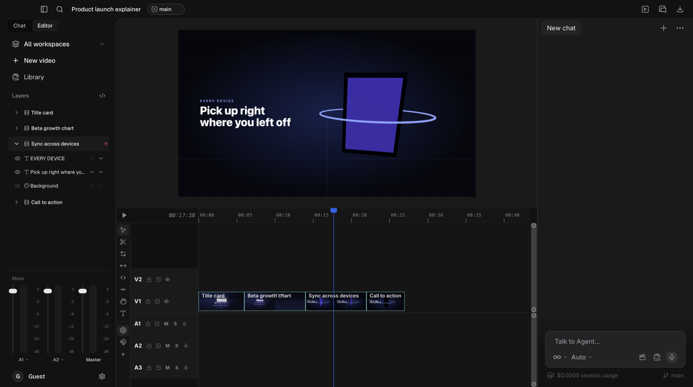
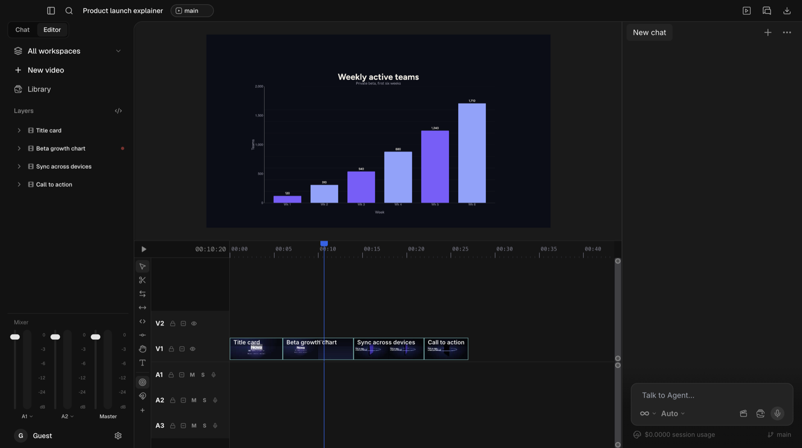

<h1 align="center">Dreambyte</h1>

<p align="center"><strong>An AI video editor.</strong> Describe a video, get an animated, fully editable timeline — then refine every layer yourself.</p>

<p align="center">
  <a href="https://github.com/danrublop/dreambyte/actions/workflows/ci.yml"></a>
  <a href="LICENSE"></a>
  <a href="#requirements"></a>
  <a href="https://nodejs.org"></a>
</p>

<p align="center">
  <a href="https://www.typescriptlang.org"></a>
  <a href="https://www.electronjs.org"></a>
  <a href="https://nextjs.org"></a>
  <a href="https://react.dev"></a>
  <a href="https://threejs.org"></a>
  <a href="https://animejs.com"></a>
  <a href="https://orm.drizzle.team"></a>
  <a href="https://ffmpeg.org"></a>
  <a href="https://modelcontextprotocol.io"></a>
</p>

<p align="center">
  
</p>
<p align="center">
  
</p>

Dreambyte is a desktop app (Electron) that combines code-driven animation, generative media, audio,
and your own footage on one timeline. An agent plans and builds scenes from a prompt; everything it
makes stays editable — layers, timing, styles, camera, and interactions — like a traditional editor.

> **Status:** pre-1.0 and under active development. Expect rough edges and breaking changes.

## Contents

- [What it does](#what-it-does)
- [Requirements](#requirements)
- [Install](#install)
- [Development](#development)
- [Configuration](#configuration)
- [Architecture](#architecture)
- [Security model](#security-model)
- [Telemetry](#telemetry)
- [Contributing](#contributing)
- [Acknowledgements](#acknowledgements)
- [License](#license)

## What it does

```
Prompt  →  Agent plans + builds scenes  →  Edit on the timeline  →  Export MP4 / interactive bundle
```

- **Prompt to animated video.** One agent plans the video, picks a renderer per scene, writes the
  scene code, generates media, and verifies the result, building every scene in order in one
  context so the video stays visually consistent. Optional Explore, Plan, and Verification
  sub-agents handle research, planning, and review. The agent has 83 tools and works with Anthropic, OpenAI, Google Gemini, DeepSeek, Kimi
  (Moonshot), Qwen (DashScope), or local models via Ollama / any OpenAI-compatible endpoint.
- **10 scene renderers.** SVG, Canvas2D, motion (HTML/CSS + anime.js), D3, Three.js, Lottie, Zdog,
  React, 3D worlds, and avatar scenes. Scenes are deterministic and seekable, so preview and export
  match frame for frame.
- **Timeline editing.** Multi-track timeline with trimming, splitting, snapping, keyframes, clip
  colour labels, audio gain and mixing, colour grading (LUTs, wheels, curves), camera moves, and
  16 style presets.
- **30+ media providers.** Image, video, avatar, text-to-speech, music, sound-effect, and stock/
  research providers (for example fal, Google Veo/Imagen, OpenAI, Runway, HeyGen, ElevenLabs,
  Freesound, Pixabay, Pexels, Unsplash), plus local options such as a built-in music composer.
  Bring your own API keys; every provider is optional.
- **Your own media.** Import footage, images, and audio; record screen, microphone, and webcam.
- **Interactive publishing.** Add hotspots, choices, quizzes, gates, tooltips, and forms with
  branching between scenes, then publish a self-contained bundle (scene HTML, manifest, and `player.js`) for the
  [`@dreambyte/player`](packages/player) runtime.
- **MCP server.** Drive the running app from Claude Code, Cursor, or any MCP client with the same
  tools the in-app agent uses.
- **Export.** MP4 via offscreen frame capture and FFmpeg (720p/1080p/4K at 24–60 fps), plus FCPXML.

## Requirements

- **OS:** macOS is the primary development platform. electron-builder is configured for macOS (DMG,
  arm64 + x64), Windows (NSIS, x64), and Linux (AppImage, x64); Windows and Linux builds are less
  tested.
- **Node.js 22** and npm (see [`apps/desktop/.nvmrc`](apps/desktop/.nvmrc)).
- **FFmpeg:** required for MP4 export and audio/video processing, and not bundled with the app.
  On macOS use `brew install ffmpeg-full`: caption burn-in needs a build with libass (the
  `subtitles` filter), which Homebrew's plain `ffmpeg` lacks. Elsewhere use your package manager or
  [ffmpeg.org](https://ffmpeg.org/download.html). Dreambyte looks for `DREAMBYTE_FFMPEG_PATH` (or
  `FFMPEG_PATH`), then on macOS Homebrew's `ffmpeg-full` (`/opt/homebrew/opt/ffmpeg-full/bin`,
  `/usr/local/opt/ffmpeg-full/bin`, preferred over plain `ffmpeg`), then `PATH`, then
  `/opt/homebrew/bin` and `/usr/local/bin`.
- **API keys:** optional. At least one model-provider key (or a local model) is needed for the
  agent; media providers are enabled per key.
- **Optional sidecars:** MusicGen (`npm run music-sidecar:setup`) and a CUDA-only video-understanding
  sidecar in `apps/desktop/sidecars/marlin/` require Python; the app runs without them. The video sidecar is
  offered only on NVIDIA hosts whose `python3` (or `DREAMBYTE_PYTHON`) has the packages in
  `apps/desktop/sidecars/marlin/requirements.txt`.

## Install

Prebuilt desktop builds are published on the
[Releases page](https://github.com/danrublop/dreambyte/releases) when available. Builds are not
code-signed or notarized yet: on macOS, right-click the app and choose **Open** the first time; on
Windows, choose **More info → Run anyway** in SmartScreen.

To run from source, see [Development](#development).

## Development

```bash
git clone https://github.com/danrublop/dreambyte.git
cd dreambyte
npm ci                          # installs every workspace (apps/desktop + packages/*)
cd apps/desktop
cp .env.example .env            # optional: provider keys
npm run dev:desktop
```

This is an npm workspaces monorepo: the Electron + Next.js app is `apps/desktop/`, and
`packages/` holds the player runtime, the motion DSL, and the FFmpeg export modules. Run app
commands from `apps/desktop/` (or from the root with `-w apps/desktop`, e.g.
`npm run test:ci -w apps/desktop`). Paths below are relative to `apps/desktop/` unless they start
with `packages/` or `docs/`.

`dev:desktop` watches the Electron main/preload bundle and the renderer and launches Electron. The
database is created and migrated automatically on first launch at `<userData>/dreambyte.db`
(macOS: `~/Library/Application Support/dreambyte/`). To keep a dev run away from your normal app
data, launch Electron with its own profile:

```bash
npm run build:renderer && npm run build:electron   # in apps/desktop
DREAMBYTE_FORCE_STATIC=1 npx electron . --user-data-dir=/tmp/dreambyte-dev
```

| Command                                             | What it does                                                          |
| --------------------------------------------------- | --------------------------------------------------------------------- |
| `npm run dev:desktop`                               | Electron + esbuild watch + renderer watch                             |
| `npm run dev:electron`                              | Same, but builds the renderer once                                    |
| `npm run lint` / `npm run typecheck`                | ESLint / TypeScript                                                   |
| `npm run test:ci`                                   | Vitest, single run                                                    |
| `npm run build:renderer` / `npm run build:electron` | Static renderer export to `out/` / main + preload to `dist-electron/` |
| `npm run build:player`                              | Publish-embed player runtime to `packages/player/dist/`               |
| `npm run dist:dir`                                  | Unpacked desktop build in `release/` (fetches audio assets first)     |
| `npm run mcp`                                       | Stand-alone MCP server over stdio                                     |

### MCP server

With the desktop app running, [`apps/desktop/.mcp.json`](apps/desktop/.mcp.json) lets MCP clients opened in `apps/desktop/`
connect automatically (`node scripts/mcp/mcp-connect.js` forwards to the app's local socket).
`npm run mcp` starts a stdio server directly; set `PROJECT_ID=<id>` to target a specific project.
The [`/dreambyte` skill](apps/desktop/.claude/skills/dreambyte/SKILL.md) (in `apps/desktop/.claude/skills/`, picked up when Claude Code runs in
`apps/desktop/`) teaches coding agents to plan and write
scenes through those tools.

## Configuration

In development the app reads `.env.local`, then `.env`, from `apps/desktop/`. Packaged builds read
`<userData>/dreambyte.env`, and keys entered in **Settings** are stored encrypted with the OS keychain
(Electron `safeStorage`). All keys are optional; see [`apps/desktop/.env.example`](apps/desktop/.env.example) for the full list.

| Variable                                                                                               | Used for                                         |
| ------------------------------------------------------------------------------------------------------ | ------------------------------------------------ |
| `ANTHROPIC_API_KEY`, `OPENAI_API_KEY`, `GOOGLE_AI_KEY`                                                 | Agent models, image/video/TTS on those platforms |
| `DEEPSEEK_API_KEY`, `MOONSHOT_API_KEY`, `DASHSCOPE_API_KEY`                                            | DeepSeek, Kimi, and Qwen agent models            |
| `OLLAMA_ENDPOINT`                                                                                      | Local models (default `http://localhost:11434`)  |
| `TAVILY_API_KEY`                                                                                       | Web search for models without native search      |
| `FAL_KEY`, `HEYGEN_API_KEY`, `RUNWAY_API_KEY`                                                          | Image, video, and avatar generation              |
| `ELEVENLABS_API_KEY`, `GOOGLE_TTS_API_KEY`                                                             | Speech, music, and sound effects                 |
| `UNSPLASH_ACCESS_KEY`, `PEXELS_API_KEY`, `PIXABAY_API_KEY`, `FREESOUND_API_KEY`, `LOTTIEFILES_API_KEY` | Stock media, music, and sound effects            |
| `DATABASE_URL`                                                                                         | Override the SQLite file (`file:…`)              |
| `DREAMBYTE_TELEMETRY_URL`, `DREAMBYTE_SENTRY_DSN`                                                      | Opt-in analytics and crash reporting (see below) |

## Architecture

Paths in this section are relative to `apps/desktop/`.

```
┌────────────── Electron main process (src/electron/) ───────────────┐
│ IPC handlers (src/electron/ipc/) · agent runner (src/lib/agents/)  │
│ SQLite (Drizzle + libSQL) · dreambyte:// protocol · MCP bridge     │
│ MP4 export: offscreen capture → @dreambyte/render-server (FFmpeg)  │
└──────────▲──────────────────────────────────────────▲──────────────┘
           │ preload: window.dreambyteApi             │ 127.0.0.1 + bearer token
┌──────────┴──────────────────────────┐   ┌───────────┴──────────────┐
│ Renderer: Next.js static export     │   │ MCP server process       │
│ served from dreambyte://app/        │   │ scripts/mcp/mcp-server.ts│
│ React + Zustand editor              │   │ (Claude Code, Cursor, …) │
│  └─ sandboxed scene iframes         │   └──────────────────────────┘
│     dreambyte://scene-frame/<id>    │
└─────────────────────────────────────┘
```

- **Main process** (`src/electron/main.ts`) loads env, runs database migrations, registers the
  `dreambyte://` protocol, and wires every IPC handler (`src/electron/ipc/index.ts`). There are no HTTP
  API routes: every backend capability is an `ipcMain.handle` on a `dreambyte:*` channel.
- **Preload** (`src/electron/preload.ts`) exposes `window.dreambyteApi` to the renderer.
- **Renderer** is a Next.js App Router app with a single editor page, exported statically to `out/`
  and served from `dreambyte://app/`. Editor state lives in a Zustand store (`src/lib/store/`).
- **Scene runtime.** Each scene is a standalone HTML document assembled by `generateSceneHTML()`
  (`src/lib/sceneTemplate.ts`) and written to `<userData>/scenes`. The editor previews it in an iframe on
  the separate `dreambyte://scene-frame/` origin. Every scene is driven by one seekable anime.js
  master timeline (`src/lib/scene-html/playback-controller.ts`), so preview and export land on the same
  frame. Scenes use the Dreambyte SDKs in `public/sdk/` and vendored libraries in `public/vendor/`;
  some renderer libraries (for example D3, Zdog, Lottie) load from pinned CDN URLs.
- **Agent** (`src/lib/agents/`) runs in the main process. `runner.ts` is the tool-use loop,
  `tools.ts` defines the tools, `tool-executor.ts` and `tool-handlers/` implement them against an
  in-memory copy of the project, and the result is saved in one transaction at the end of the run.
  When sub-agents are on, `director-loop.ts` builds the planned scenes. Provider adapters in
  `src/lib/agents/providers/` cover Anthropic, OpenAI, Google, and OpenAI-compatible APIs (DeepSeek, Kimi,
  Qwen, Ollama).
- **Media providers** for image, video, avatar, audio, and stock/research sources are registered in
  `src/lib/media/provider-registry.ts`, `src/lib/audio/provider-registry.ts`, and `src/lib/research/providers/`.
- **Database** is one SQLite file (`<userData>/dreambyte.db`) accessed through Drizzle ORM and libSQL
  (`src/lib/db/`), with migrations in `src/lib/db/migrations/`.
- **Export** replays the timeline in an offscreen window, captures frames, and encodes them with the
  FFmpeg stitching and audio-mixing modules in `packages/render-server/`.
- **MCP.** `scripts/mcp/mcp-server.ts` exposes the agent's tools to external clients and calls back
  into the running app through a local HTTP bridge (`src/electron/mcp-bridge.ts`).

Layering rules, the remaining module cycles, and the plan for splitting the largest files
(`runner.ts`, `tools.ts`, `tool-executor.ts`, `AgentChat.tsx`, `PreviewPlayer.tsx`) are in
[docs/ARCHITECTURE.md](docs/ARCHITECTURE.md).

### Project structure

```
apps/desktop/          The Electron + Next.js app (its own package.json, configs, CLAUDE.md, AGENTS.md)
  src/app/             Next.js entry (single editor page)
  src/components/      React UI: editor, timeline, inspector, chat, settings
  src/hooks/           React hooks for recording and devices
  src/electron/        Main process, preload, IPC handlers, export, MCP bridge
  src/lib/             Core logic: agents, db (+ migrations), timeline, audio, media providers, export
  src/types/           Ambient type declarations (preload API, Electron)
  public/              Scene SDKs, vendored libraries, 3D models, sound effects
  resources/           App icons, entitlements, MediaPipe model (electron-builder buildResources)
  scripts/             build, release, mcp, assets, okf, db, dev, smoke
  sidecars/            Optional Python sidecars: marlin (CUDA video understanding), musicgen, voxcpm
  evals/               Agent, codegen and motion-design evaluations
  docs/agent/          Prompt docs shipped with the app
  .claude/, .agents/   Agent skills (/dreambyte and the Impeccable design skills)
packages/
  player/              @dreambyte/player — interactive player runtime
  motion-dsl/          @dreambyte/motion-dsl — motion preset library (npm package)
  render-server/       @dreambyte/render-server — FFmpeg stitching/mixing modules and FFmpeg lookup
docs/                  Architecture, design systems, telemetry, changelog, third-party notices, runbooks
.github/               CI workflows, contributing guide, security policy
```

## Security model

Generated scene code is treated as untrusted:

- **Isolated scene origin.** Scenes load from `dreambyte://scene-frame/…`, a different origin from
  the app (`dreambyte://app/…`), inside sandboxed iframes, with a Content-Security-Policy that limits
  network access to the app's own protocol and an allowlist of library CDNs.
- **No Node.js in the renderer.** The editor window runs with `contextIsolation: true` and
  `nodeIntegration: false`; new windows are denied and navigation is locked to the app origin.
- **Narrow preload surface.** The preload script exposes `window.dreambyteApi`, where each method
  wraps one fixed `dreambyte:*` IPC channel — there is no generic `invoke` passthrough — and main-
  process handlers validate their inputs.
- **Local MCP bridge.** The bridge listens only on `127.0.0.1` and requires a per-launch bearer
  token.
- **Keys at rest.** Provider keys entered in the app are encrypted with Electron `safeStorage`.

Please report vulnerabilities privately — see [SECURITY.md](.github/SECURITY.md).

## Telemetry

Telemetry is **off by default**. Product analytics and crash reports are only sent when you
configure an endpoint (`DREAMBYTE_TELEMETRY_URL`, `DREAMBYTE_SENTRY_DSN`). Analytics events carry an
anonymous device ID, app version, platform, and small numeric/enum properties — no prompts, project
content, or API keys. The agent's `send_feedback` reports and launch-failure events also include
short error or summary text. Set `DREAMBYTE_TELEMETRY_DISABLED=1` or create
`<userData>/.telemetry-disabled` to force both off. Details in [docs/TELEMETRY.md](docs/TELEMETRY.md).

## Contributing

Contributions are welcome — see [CONTRIBUTING.md](.github/CONTRIBUTING.md) for setup, checks, and pull
request expectations. [apps/desktop/CLAUDE.md](apps/desktop/CLAUDE.md) is the detailed codebase reference
(with [AGENTS.md](apps/desktop/AGENTS.md) for MCP clients), and [CHANGELOG.md](docs/CHANGELOG.md) tracks releases.

## Acknowledgements

Dreambyte builds on many open-source projects, including:

- [Electron](https://www.electronjs.org/), [Next.js](https://nextjs.org/), [React](https://react.dev/),
  [Zustand](https://github.com/pmndrs/zustand), [Tailwind CSS](https://tailwindcss.com/), and
  [Monaco Editor](https://github.com/microsoft/monaco-editor)
- [anime.js](https://animejs.com/), [Three.js](https://threejs.org/), [D3](https://d3js.org/),
  [PixiJS](https://pixijs.com/), [Lottie](https://github.com/airbnb/lottie-web),
  [Zdog](https://zzz.dog/), and [html2canvas](https://html2canvas.hertzen.com/)
- [FFmpeg](https://ffmpeg.org/) (user-installed) and [Mediabunny](https://mediabunny.dev/)
- [Drizzle ORM](https://orm.drizzle.team/) and [libSQL](https://github.com/tursodatabase/libsql)
- [Model Context Protocol TypeScript SDK](https://github.com/modelcontextprotocol/typescript-sdk)
- [Anthropic](https://github.com/anthropics/anthropic-sdk-typescript),
  [OpenAI](https://github.com/openai/openai-node), and
  [Google Gen AI](https://github.com/googleapis/js-genai) SDKs
- [SpessaSynth](https://github.com/spessasus/spessasynth_core), [Magenta.js](https://github.com/magenta/magenta-js),
  [Transformers.js](https://github.com/huggingface/transformers.js), and
  [MediaPipe](https://github.com/google-ai-edge/mediapipe)
- [Impeccable](https://github.com/pbakaus/impeccable) design skills, and preview playback patterns
  modelled on [HeyGen Hyperframes](https://github.com/heygen-com/hyperframes)
- 3D models by [Kenney](https://kenney.nl/) and HDRIs from [Poly Haven](https://polyhaven.com/)

Full attributions and license texts: [THIRD_PARTY_NOTICES.md](docs/THIRD_PARTY_NOTICES.md) and
[docs/THIRD_PARTY_AUDIO.md](docs/THIRD_PARTY_AUDIO.md).

## License

Dreambyte is licensed under the [MIT License](LICENSE). Copyright (c) 2026 Daniel Lopez.
Third-party components remain under their own licenses.
